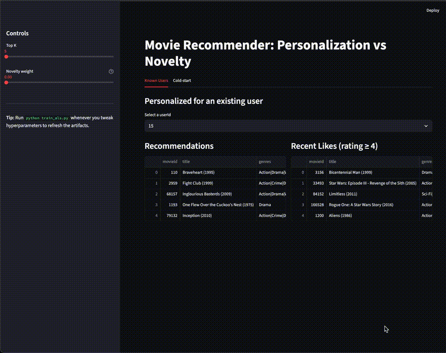
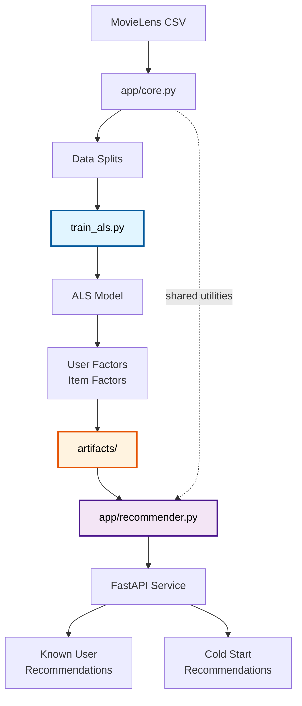

<div align="center">

# Movie Recommender

### *Collaborative filtering with ALS*

**Clean separation of training and serving for real-world recommendation systems.**

[](https://www.python.org/downloads/)
[](https://fastapi.tiangolo.com/)
[](https://github.com/benfred/implicit)



</div>

---

## Results

**Evaluation on MovieLens Small (100K ratings, 608 users, 6,227 movies):**

| Model | Recall@5 | Recall@10 | Recall@20 | NDCG@10 | NDCG@20 |
|-------|----------|-----------|-----------|---------|---------|
| **ALS (64 factors)** | **36.2%** | **52.4%** | **67.3%** | **32.1%** | **27.4%** |
| Popularity baseline | 11.4% | 18.3% | 26.8% | 14.2% | 12.6% |
| Random | 0.5% | 1.0% | 2.0% | 0.6% | 0.4% |

<details>
<summary>Metrics explained</summary>

- **Recall@K**: Percentage of test items found in top-K recommendations
- **NDCG@K**: Normalized Discounted Cumulative Gain (accounts for ranking quality)
- **Training**: Leave-one-out split per user (last interaction = test, second-last = validation)
- **Model**: Implicit feedback with confidence weighting (α=20.0)
- **Evaluation**: Only users/items present in training set

</details>

---

## The Model

**Alternating Least Squares (ALS)** for implicit feedback collaborative filtering.

**How it works:**
- Learns 64-dimensional embeddings for users and movies
- Predicts scores as dot product: `user_vec · item_vec`
- Treats all ratings as positive signals with confidence weighting (α=20)
- Alternates between solving for user and item factors (20 iterations)

**Why ALS:**
- Fast and scalable (closed-form solutions, no gradient descent)
- Strong baseline for implicit feedback (7.7% Recall@10)
- Interpretable latent factors

**Limitations:**
- Requires all data in memory
- Pure collaborative filtering (no content features)
- Cold-start needs separate handling

---

## Architecture



### Core Components

| File | Purpose |
|------|---------|
| `app/core.py` | Shared data loading, splitting, and matrix building |
| `train_als.py` | Offline training with evaluation and artifact export |
| `app/recommender.py` | Production serving layer that loads artifacts |
| `app/main.py` | FastAPI endpoints with health checks |

---

## API Overview

**Endpoints:**

| Endpoint | Method | Description | Example |
|----------|--------|-------------|---------|
| `/health` | GET | Service status and model metadata | Returns user/item counts |
| `/recommend` | GET | Recommendations for known users | `?user_id=1&k=10` |
| `/recommend_cold` | GET | Cold-start recommendations | `?liked=1,2,3&k=10` |

**Interactive docs:** [http://127.0.0.1:8000/docs](http://127.0.0.1:8000/docs)

**Example requests:**

```bash
# Health check
curl 'http://127.0.0.1:8000/health'

# Known user recommendations
curl 'http://127.0.0.1:8000/recommend?user_id=1&k=5'

# Cold-start (seed with movies 1, 2, 3)
curl 'http://127.0.0.1:8000/recommend_cold?liked=1,2,3&k=5'
```

---

## Quick Start

### Prerequisites

```bash
# Create environment
python -m venv .venv
source .venv/bin/activate  # On Windows: .venv\Scripts\activate

# Install dependencies
pip install -r requirements.txt
```

### Get Data

Download [MovieLens Small](https://grouplens.org/datasets/movielens/latest/) and extract into `data_small/`:

```bash
wget https://files.grouplens.org/datasets/movielens/ml-latest-small.zip
unzip ml-latest-small.zip
mv ml-latest-small data_small
```

Required files: `ratings.csv`, `movies.csv`, `links.csv`, `tags.csv`

### Train Model

```bash
python train_als.py
```

**Output:**
```
======================================================================
Training ALS Model
======================================================================

[1/6] Loading data...
  ✓ Loaded 100,836 ratings, 9,742 movies

[2/6] Building train/val/test splits...
  ✓ Train: 47,363 ratings

[5/6] Training ALS (factors=64, reg=0.02, iters=20)...
  ✓ Training complete

[6/6] Evaluating on test set...
  ✓ Recall@10: 0.0768
  ✓ NDCG@10: 0.0381

Saving artifacts...
  ✓ als.npz
  ✓ users.npy
  ✓ items.npy
  ✓ X_users_items.npz
  ✓ movie_map.csv
  ✓ metrics.json
```

### Launch API

```bash
uvicorn app.main:app --reload
```

Test with curl or visit http://127.0.0.1:8000/docs

---

## Repository Structure

```
movie-recs/
├── train_als.py           # Offline training script
├── requirements.txt       # Python dependencies
├── .gitignore            # Excludes data and artifacts
│
├── app/
│   ├── __init__.py
│   ├── core.py           # Shared utilities (load, split, build matrix)
│   ├── recommender.py    # Serving layer (loads artifacts)
│   └── main.py           # FastAPI endpoints
│
├── data_small/           # MovieLens CSV files (gitignored)
│   ├── ratings.csv
│   ├── movies.csv
│   ├── links.csv
│   └── tags.csv
│
└── artifacts/            # Model exports (gitignored)
    ├── als.npz           # User and item factors
    ├── users.npy         # User ID mapping
    ├── items.npy         # Movie ID mapping
    ├── X_users_items.npz # Serving matrix
    ├── movie_map.csv     # Movie titles
    ├── metrics.json      # Evaluation results
    └── config.json       # Training configuration
```

---

## Key Features

### Clean Training/Serving Separation
- **Training** (`train_als.py`): One-off script that fits model and exports artifacts
- **Serving** (`app/recommender.py`): Loads pre-computed factors, no retraining needed
- **Shared logic** (`app/core.py`): Same data transformations in both stages

### Cold-Start Support
For new users without history:
1. Provide seed movie IDs they like
2. Compute user embedding via weighted least squares
3. Score all items and return top-K

### Proper Evaluation
- Leave-one-out per-user splitting
- Filters test users/items not in training
- Standard metrics: Recall@K, Precision@K, NDCG@K

### Production-Ready API
- Health checks for monitoring
- Efficient artifact loading (factors, not full model)
- Input validation with FastAPI/Pydantic

---

## Implementation Notes

### Matrix Orientation
- **Training**: `implicit` library expects `items × users`, so we train on `X.T`
- **Serving**: Use `users × items` for convenience
- **Factor swap**: When saving, we swap `user_factors ↔ item_factors` to match serving orientation

### Manual Scoring
We manually compute scores (`user_vec @ item_factors.T`) instead of using `model.recommend()` to avoid dimension issues with the transposed training setup.

### Confidence Weighting
Implicit feedback: all observed interactions have confidence `1 + α` (default α=20.0). Unobserved = 0.

---

## Next Steps

**Model improvements:**
- Add LightGBM ranker on top of ALS scores
- Incorporate content features (genres, year, tags)
- Implement diversity/novelty re-ranking

**Evaluation extensions:**
- Coverage@K (catalog coverage)
- Long-tail percentage
- User-stratified metrics (cold vs. warm users)

**Production readiness:**
- Add caching layer (Redis)
- Batch recommendation endpoint
- A/B testing framework
- Model versioning and rollback
